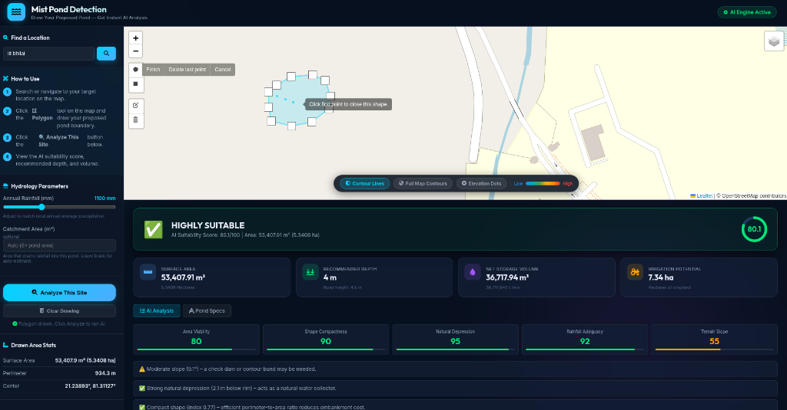
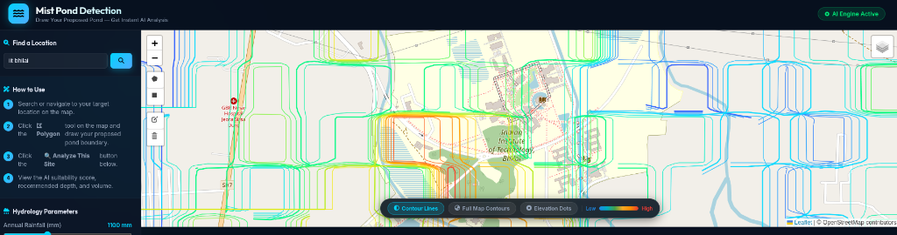

# 💧 Mist Pond Detection

**Smart AI-Based Pond Suitability & Hydrology System with Full Viewport Topographic Contours**

Draw any proposed pond boundary on the map to receive instant AI suitability analysis, recommended excavation depth, net storage volume, irrigation potential, and full-screen topographic iso-contour mapping.

---

## 📸 Screenshots

### 1. Site Suitability & AI Hydrology Analysis

*Interactive polygon drawing tool with AI suitability scoring, recommended depth, storage volume, and construction feasibility feedback.*

### 2. Full Viewport Topographic Contour Engine

*Marching Squares elevation iso-contour curves with smooth Chaikin corner-smoothing and low-to-high rainbow gradient across the entire map viewport.*

---

## 🚀 Quick Start

```bash
# Install dependencies
pip install flask requests numpy

# Run the application
python3 web_app.py
```

Open `http://localhost:5000` in your web browser.

---

## 🗺️ Key Features

1. **Interactive Site Selection**: Draw proposed farm pond boundaries directly on the map.
2. **AI Suitability Engine**: Multi-factor scoring analyzing terrain slope, natural depressions, shape compactness, area viability, and annual rainfall.
3. **Hydrology & Storage Recommendations**: Computes optimal pond depth, gross storage volume, net usable volume (accounting for evaporation & seepage loss), and potential cropland hectares irrigated.
4. **Full Viewport Topographic Contours**: 2D Marching Squares engine generating smooth rainbow iso-contour lines across the entire visible map area.

---

## 📁 Project Structure

```
smart_pond_detection/
├── web_app.py              # Flask web server & API routes
├── suitability_engine.py   # AI suitability scoring & elevation grid fetcher
├── hydrology_engine.py     # Runoff & volume calculation engine
├── assets/
│   ├── site_suitability_analysis.png
│   └── full_map_topographic_contours.png
├── templates/
│   └── index.html          # UI layout with Leaflet map & stats sidebar
└── static/
    ├── style.css           # Modern dark glassmorphism styling
    └── app.js              # Marching Squares engine & UI interaction logic
```

---

## 🛠️ Tech Stack

- **Backend**: Python 3 + Flask
- **Elevation Data**: Open-Elevation API + NumPy grid processing
- **Contour Engine**: Client-side Marching Squares algorithm + Chaikin line smoothing
- **Frontend**: HTML5, Vanilla JavaScript, Leaflet.js, Leaflet Draw
- **Map Tiles**: OpenStreetMap & Esri World Imagery
