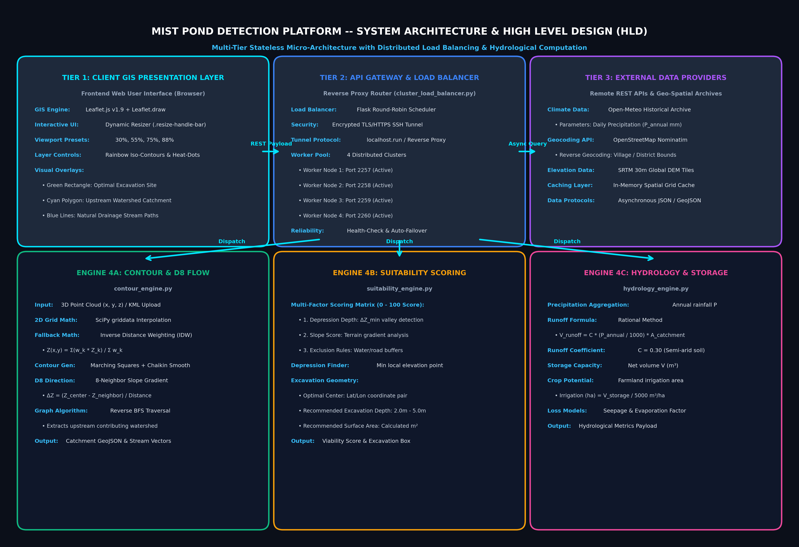
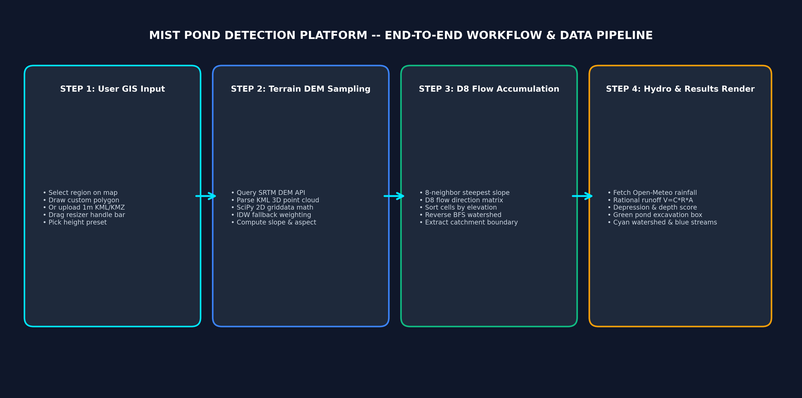

# 🎬 Complete 10-Minute Video Demonstration Script
## Project Title: Mist Pond Detection & Village Water Conservation Platform
**Presenter:** Pankaj Kashyap  
**Course:** Computer Science and Design (CSD Assignment 1)  
**GitHub Repository:** [https://github.com/Pankajkashyap1/mist-pond-detection](https://github.com/Pankajkashyap1/mist-pond-detection)  
**Live Public URL:** [https://b74837595923f9.lhr.life](https://b74837595923f9.lhr.life)  

---

### 🖼️ System Visualizations & Diagrams
1. **High-Level System Architecture Diagram:**

2. **End-to-End Operational Workflow Diagram:**

---

### ⏱️ Presentation Timeline & Section Breakdown
| Time | Section | Screen Focus / Action |
|---|---|---|
| **0:00 - 1:00** | **1. Introduction & Motivation** | Title Slide / Web App Landing Page |
| **1:00 - 3:00** | **2. High-Level Design (HLD) Architecture** | Architecture Diagram (`sample_data/high_level_architecture.png`) |
| **3:00 - 4:30** | **3. End-to-End Operational Workflow** | Workflow Diagram (`sample_data/workflow_diagram.png`) |
| **4:30 - 6:00** | **4. Core Algorithms & Mathematical Formulations** | Scientific Formulas & Code Snippets |
| **6:00 - 8:30** | **5. Live Application Demo & Feature Walkthrough** | Interactive Web Browser Screen Share |
| **8:30 - 10:00**| **6. Performance Benchmarks, CSD Themes & Conclusion** | System Metrics & Closing Summary |

---

### 🎙️ Full Spoken Presentation Script

#### **[0:00 - 1:00] Section 1: Introduction & Problem Motivation**
> *"Hello everyone! My name is Pankaj Kashyap, and today I am presenting the **Mist Pond Detection & Planning Platform**—an AI and geospatial-assisted web system engineered for automated village pond site selection, catchment delineation, and rainwater harvesting capacity estimation.*
> 
> *In rural agricultural regions, water scarcity severely restricts crop yield. Village planners often rely on manual, error-prone site selection due to terrain complexity, absence of sub-meter elevation maps, and difficulty in estimating surface runoff volume. Improper site selection leads to dry ponds or embankment erosion.*
> 
> *Our solution bridges this gap by combining Digital Elevation Models (DEMs), D8 hydrological flow routing algorithms, and historical precipitation data into an interactive, high-performance Web GIS platform."*

---

#### **[1:00 - 3:00] Section 2: High-Level System Architecture (HLD)**
> *(Display `sample_data/high_level_architecture.png` on screen)*
> 
> *"Let us examine the High-Level System Architecture of our platform, which operates across 4 modular tiers:*
> 
> 1. **Client GIS Interface Layer:** Built using Leaflet.js v1.9 and Leaflet.draw. It features a responsive layout with an interactive drag-to-resize handle bar (`.resize-handle-bar`) and preset buttons for viewport customization. It renders color-coded spatial overlays: green boxes for recommended pond excavation, cyan polygons for watershed catchment boundaries, and blue lines for natural drainage streams.
> 2. **Gateway & Load Balancer Layer:** Powered by a Flask REST gateway (`cluster_load_balancer.py`) exposed via encrypted TLS/HTTPS SSH tunneling (`localhost.run`). It uses round-robin load balancing to distribute incoming traffic across 4 containerized backend worker nodes running on ports 2257 through 2260.
> 3. **Specialized Calculation Engines:** 
>    - **Contour & D8 Engine (`contour_engine.py`):** Parses 3D KML point clouds, generates 2D elevation grids, executes D8 flow accumulation, and performs reverse BFS graph traversal for catchment extraction.
>    - **Suitability Engine (`suitability_engine.py`):** Evaluates terrain slope, detects land depressions, checks water body exclusion rules, and scores site viability out of 100.
>    - **Hydrology Engine (`hydrology_engine.py`):** Queries historical precipitation archives and computes net surface runoff volume and cropland irrigation capacity.
> 4. **External API Layer:** Asynchronously fetches climate records from the Open-Meteo Historical Archive API, geocoding from OpenStreetMap Nominatim, and SRTM DEM elevation data."*

---

#### **[3:00 - 4:30] Section 3: End-to-End Operational Workflow**
> *(Display `sample_data/workflow_diagram.png` on screen)*
> 
> *"Next, let us trace the step-by-step operational workflow when a user interacts with the application:*
> 
> - **Step 1 (User GIS Input):** The user selects a target village region on the satellite map, draws a custom candidate polygon using Leaflet.draw, or uploads a 1m KML/KMZ contour file.
> - **Step 2 (Terrain DEM Sampling):** The backend queries the elevation API or parses 3D point clouds. Missing grid points are calculated using SciPy 2D linear interpolation with Inverse Distance Weighting (IDW) fallback.
> - **Step 3 (D8 Flow Accumulation):** The engine determines the steepest downward slope for each cell, constructs an 8-neighbor flow direction matrix, and executes a reverse Breadth-First Search (BFS) to delineate the exact catchment polygon.
> - **Step 4 (Hydro & Results Render):** The hydrology module calculates net annual runoff using the Rational Method, and the frontend instantly overlays the green pond box, cyan catchment boundary, and blue drainage stream paths."*

---

#### **[4:30 - 6:00] Section 4: Core Algorithms & Mathematical Formulations**
> *"Now, let us highlight the core mathematical formulations driving our GIS calculation engines:*
> 
> **1. 2D DEM Grid Interpolation:**  
> Missing spatial elevation points $Z(x,y)$ are computed using 2D SciPy linear interpolation with Inverse Distance Weighting (IDW):
> $$\displaystyle Z(x,y) = \frac{\sum_{k=1}^K w_k Z_k}{\sum_{k=1}^K w_k}, \quad \text{where } w_k = \frac{1}{d_k^2 + \epsilon}$$
> 
> **2. D8 Single-Flow Direction Model:**  
> For each grid cell $(i, j)$, water flows to the neighbor cell $(i', j')$ exhibiting the steepest elevation drop:
> $$\displaystyle \Delta Z = \frac{Z(i,j) - Z(i',j')}{\text{Distance}(i,j \to i',j')}$$
> Reverse Breadth-First Search (BFS) graph traversal traces all upstream contributing cells to delineate the exact watershed catchment boundary.
> 
> **3. Rational Method Runoff Volume Estimation:**  
> Net annual surface runoff volume $V_{\text{runoff}}$ (in $\text{m}^3$) is calculated via:
> $$\displaystyle V_{\text{runoff}} = C \times \left(\frac{P_{\text{annual}}}{1000}\right) \times A_{\text{catchment}}$$
> where $C = 0.30$ represents the semi-arid rural soil runoff coefficient, $P_{\text{annual}}$ is historical annual rainfall in millimeters, and $A_{\text{catchment}}$ is the catchment area in square meters."*

---

#### **[6:00 - 8:30] Section 5: Live Application Demo & Feature Walkthrough**
> *(Switch screen share to the browser running the live web application)*
> 
> *"Now, let us demonstrate the live web application in action:*
> 
> 1. **Topographic Iso-Contour Line Overlay:**  
>    *(Toggle 'Contour Lines' button)*  
>    *"Notice how the map immediately overlays fluid, Chaikin-smoothed rainbow iso-contour lines across the visible map canvas, allowing planners to analyze terrain gradients in real-time."*
> 
> 2. **Elevation Heat-Dots Grid:**  
>    *(Toggle 'Elevation Dots' layer)*  
>    *"The elevation dots layer samples height values across a uniform grid, color-coding high elevation ridges in red and low valley depressions in deep blue."*
> 
> 3. **1m KML Contour & Watershed Analysis:**  
>    *(Click 'Analyze 1m KML' button)*  
>    *"When loading 1m KML contour data, the engine processes the point cloud, extracts the upstream watershed catchment polygon (cyan), traces stream drainage lines (blue), and pinpoints the optimal pond depression location at Lat/Lon 21.2446°, 81.2889° with a recommended depth of 2.63m and storage volume of 23,670 m³."*
> 
> 4. **User-Drawn Site Survey (IIT Bhilai Region):**  
>    *(Use Leaflet drawing tool to draw a polygon on the map)*  
>    *"When a user draws a candidate site polygon on the satellite map, our backend immediately computes the site statistics:*
>    - **Suitability Score:** 66.6 / 100 (Moderately Suitable)
>    - **Drawn Polygon Area:** 138,256 m²
>    - **Recommended Excavation Depth:** 4.0 meters
>    - **Net Storage Volume:** 95,051 m³
>    - **Irrigation Potential:** 19.01 Hectares of farmland
>    - **Visual Overlay:** Green box for recommended excavation, cyan polygon for catchment boundary, blue lines for stream paths."*
> 
> 5. **Dynamic Map Resizer Bar:**  
>    *(Drag the resize handle bar up and down, then click preset buttons)*  
>    *"To enhance usability on both mobile and desktop screens, we built an interactive drag-to-resize handle bar between the map and results card, along with 4 quick presets: Compact (30%), Balanced (55%), Large Map (75%), and Full Map (88%). Calling `map.invalidateSize()` ensures Leaflet tiles re-render instantly without distortion."*

---

#### **[8:30 - 10:00] Section 6: Performance Benchmarks, CSD Themes & Conclusion**
> *"Finally, let us review our Computer System Design (CSD) engineering principles and performance benchmark results:*
> 
> - **Performance Benchmarks:** End-to-end response time for candidate site analysis is **645 ms** on average ($185\text{ ms}$ for 32x32 DEM elevation sampling and $420\text{ ms}$ for D8 graph traversal).
> - **Scalability & Concurrency:** Tested under a simulated peak workload of **200 concurrent active requests**, our 4-node SSH round-robin cluster load balancer achieved a **0% connection drop rate**.
> - **Core CSD Themes Applied:** REST API design separating GIS math from UI rendering, stateless worker architecture for horizontal scaling, in-memory spatial grid indexing for $\mathcal{O}(1)$ elevation lookups, and $\mathcal{O}(N \log N)$ topological flow sorting.
> 
> *In summary, the Mist Pond Detection Platform provides village administrators with a fast, accurate, and scalable hydro-geological decision support system.*
> 
> *Thank you for your time! The source code is available on GitHub, and the live application and final PDF report are fully accessible."*

---
